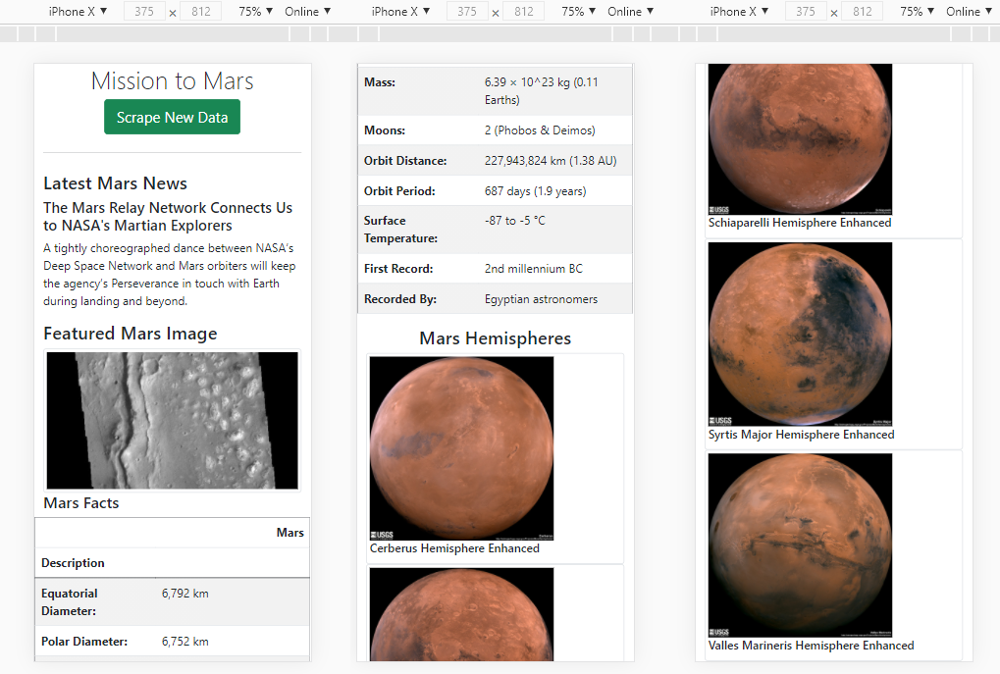

# Mission-to-Mars

## Analysis/File Walk-through

1. Finish the Jupyter Notebook starter code <b>Mission_to_Mars_Challenge.ipynb</b>
2. Convert the code from JN to <b>scraping.py</b> In this file, we are creating functions for the data to scrape. In lines 17-24 is where it's running all the scraping functions and returning them into a dictionary. Also note, this is where chrome driver is occuring and automatically scrapping the website for you. Headless=False allows you to see the computer actually scrape the data step-by-step.
3. In <b>app.py</b> , a few things are happening (1) `@app.route("/scrape")` & `def scrape` is basically scrapping the data and storing into a variable, which is then the variable that updates the mongo database. (2) Then in Line 21, it redirects back to Line 11 where it pulls the data out of the mongo database, stores it into the mars variable. (3) Then the code in Line 14 is what passes it to the html code so that html can display it.
4. In <b>index.html</b> is when we start to build our website using the data that we have scraped and collected. Notice, in Line 32, this is where the mars variable is being called to generate the `mars.news_title`, it does it again at Line 33 `mars.news_paragraph`. Line 46 calls on the `mars.featured_image`. Line 56 `mars.facts` and Line 67 `mars.hemisphere_images`.
5. Finally after all the files are in order, you can run the `app.py` and it should link you to a local host website (Line 8). In the terminal, click the link to take you to the website. You can press CTRL + C to reset and rerun again. Do not directly use the index.html to get to the website - otherwise it will not work properly.

### Mongo Database 

---

## Final Website (with Enhancements)
Part of the Challenge was to scrape the Hemisphere Images and Titles from NASA's website. Hence, the 4 images/titles were added as shown in the following:  

<b> The challenge also called for some Bootstrap Enhancements. </b> Hence a few were made (1) added `class="display-4"` to change the style/font of the website title. (2) Updated the color of the scrape button to green using `btn-success` within the class. (3) Added a divider line using `
`. (4) Made all the images into thumbnails using `img-thumbnail` in the class; this was applied to the featured image as well as the hemisphere images. (5) I also added this `
` to space out the hemisphere images in Line 68 of the index.html file.

### Final Website (as a Mobile-Responsive App)
The following depicts this website on an iPhone X: 

